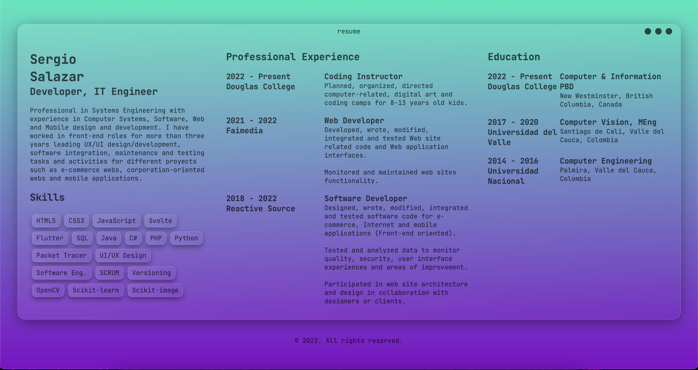
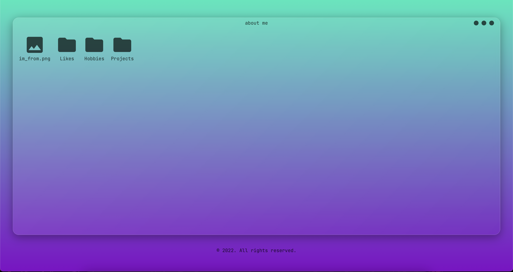
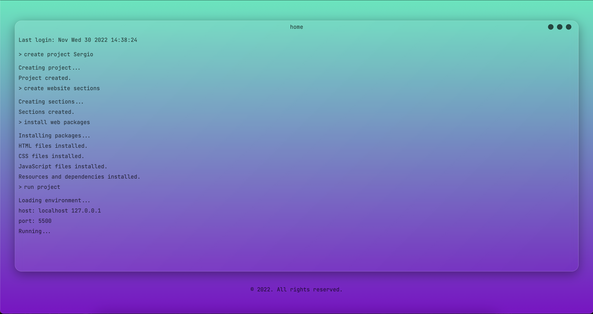
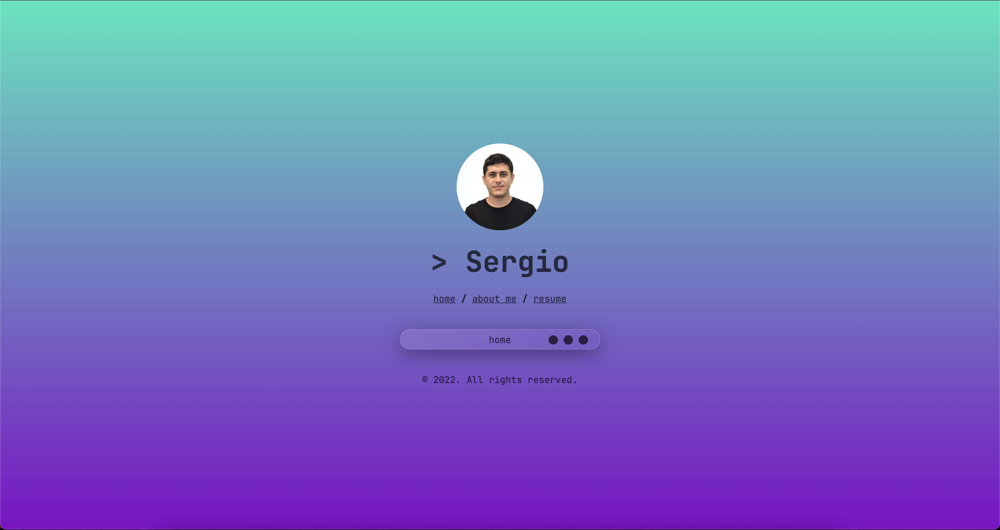

 # Project Summary

This website uses with ``HTML5``, ``CSS`` and vanilla ``JavaScript``.

 Features:
 - Glass and window shadow effect achieved with ``CSS rgba`` properties 
 - Console-like window for Home page styled with ``CSS``
 - Minimizing and maximizing effect using ``CSS transitions``
 - Button blinking effect to indicate the minimize and maximize effects using ``JavaScript``
 - Get the date as the welcome line in the console window by setting the ``Date.now()``
 - User commands and responses simulation using ``JavaScript objects`` with customized ``write``, ``wait``, ``command`` functions
 - File Explorer-like window for About Me page styled with ``CSS``
 - File interaction and preview made with ``JavaScript DOM``
 - 3 column layout style for Resume page using ``CSS flex``
 - Responsive design using ``CSS`` media queries
 
 # Project Versions

 # Version 1.3

 **Improvements**
 
 Version 1.3 includes serveral improvements over the previus versions.

 Main features added:
 - New background gradient
 - Active element indicator in About Me page using ``JavaScript``
 - Window header ``bottom-border``
 - Revamped ``overflow`` of the content viewer

 
 
 
 # Version 1.2

 **Resume**

 Version 1.2 includes the page Resume to show the professional profile inside a window.

 Main features added:
 - Custom ``col`` and ``row`` grid system using ``CSS``
 - Custom ``padding`` class using ``CSS``
 - Resume download button

 
 
 # Version 1.1

 **About Me**

 Version 1.1 includes the page About Me which simulates a file explorer with file preview.

 Main features added:
 - File selection
 - File preview
 - Background hover effect
 - ``HTML DOM`` to simulate folder selection and file preview

 
 # Version 1.0

 **Home Page**

 Version 1.0 includes the Home page. ``CSS`` and ``JavaScript`` were used to create a terminal emulation.

 Main features added:
 - Body gradient background
 - Window transparency effect
 - Window slide in animation
 - Minimizing and Maximizing window effect
 - Main menu slide-in effect after minimizing

 
